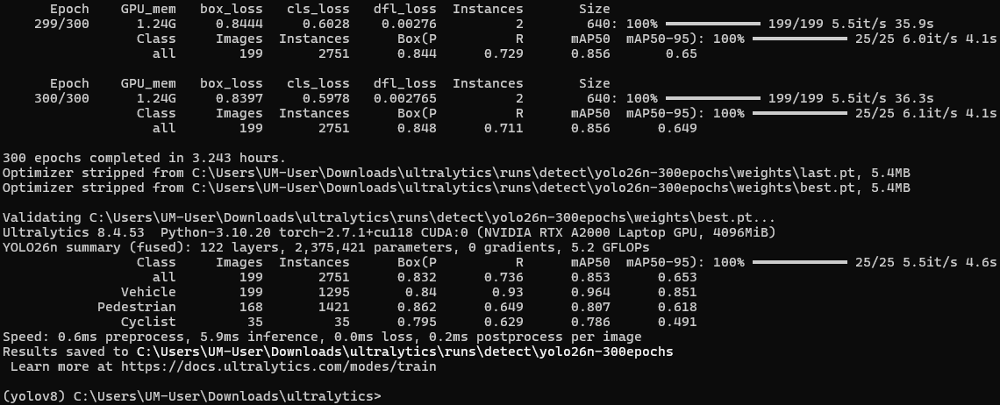
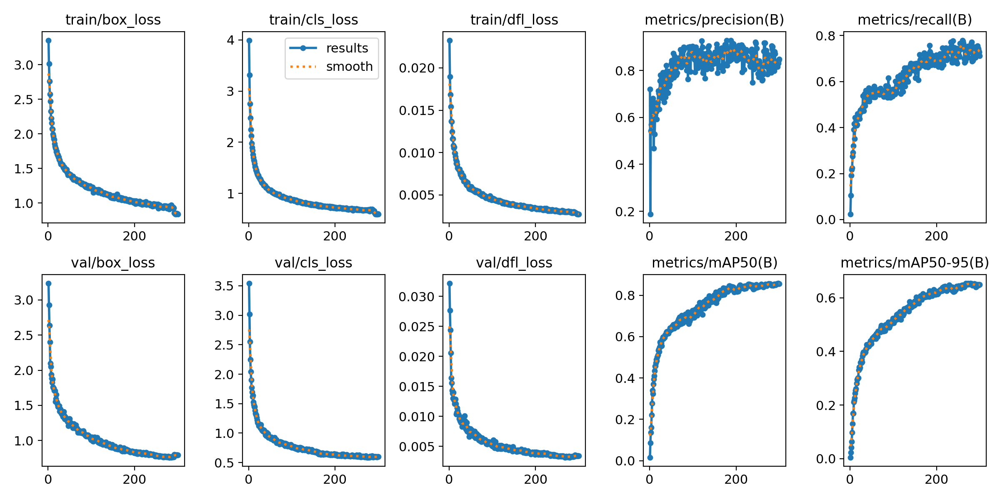
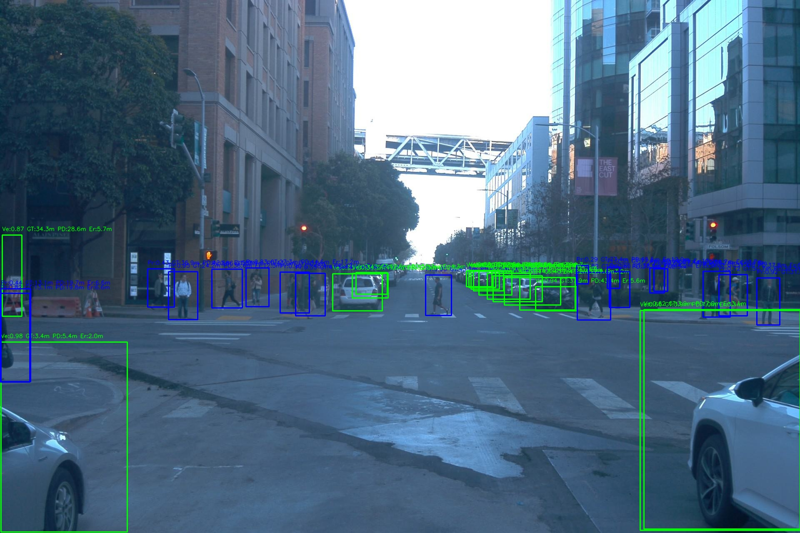
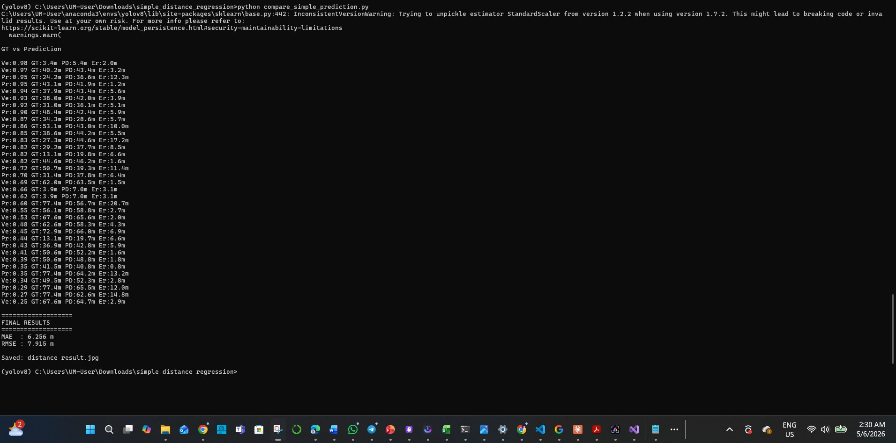

# YOLO26-Autonomous-Perception-System-On-Edge-Devices

Autonomous driving perception framework for object detection and monocular distance estimation using YOLO26 and a geometry-aware distance regression model.

## Summary of the study
#### 1st Stage: Dataset Preparation
#### 2nd Stage: YOLO26 model traning and validation on the prepared dataset
#### 3rd Stage: Regression model developed, tranined & validated, optimzed untile get satisfactory results
#### 4th Stage: Run integrated (YOLO26 + Regression) model for object detection and distance calculation
#### 5th Stage: Optimize YOLO26 model for better trade off between accuracy and inference speed
#### Final Stage: Deploy and run the model on Jetson Thor platforms


## 1st Stage: Dataset Preparation

The dataset was prepared using the Waymo Open Dataset v2.0.1.

Dataset Link:

https://console.cloud.google.com/storage/browser/waymo_open_dataset_v_2_0_1

### Initial Parquet Files

The following parquet files were used:

* training_camera_image_10023947602400723454_1120_000_1140_000.parquet
* training_projected_lidar_box_10023947602400723454_1120_000_1140_000.parquet
* training_lidar_box_10023947602400723454_1120_000_1140_000.parquet

### Step 1: Dataset Exploration

#### All python files for dataset preparation and validation are located inside the dataset_preparation_python_files folder in the repository

Script:

```text
extract_waymo.py
```

Purpose:

* Read LiDAR parquet data
* Inspect available columns and records

### Step 2: Image, Label and Distance Extraction

Script:

```text
final_waymo_extractor.py
```

Purpose:

* Extract RGB images from camera image parquet files
* Generate YOLO bounding box labels
* Generate distance labels using LiDAR annotations

Generated files:

```text
images/train/
labels/train/
distance_labels/train/
```

##### After the images in .jpg format extracted inside the train folder and labels txt files in the lebels folder, we splited the images and labels into 80:20 for train: validation ratio for traning on YOLO26 model.


YOLO label format:

```text
class_id x_center y_center width height
```

Distance label format:

```text
class_id x_center y_center width height distance
```

### Distance Calculation

The LiDAR box parquet file contains the 3D center coordinates of each detected object:

key.laser_object_id = 8f3c...

[LiDARBoxComponent].box.center.x = 32.4
[LiDARBoxComponent].box.center.y = -4.1
[LiDARBoxComponent].box.center.z = 1.8

where:

x = forward distance (m)
y = left/right offset (m)
z = height (m)

The Euclidean distance from the ego vehicle to the object is calculated as:

Distance = √(x² + y² + z²)

Example:

x = 32.4
y = -4.1
z = 1.8
Distance = √(32.4² + (-4.1)² + 1.8²)
         = √(1049.76 + 16.81 + 3.24)
         = √1069.81
         = 32.71 m

The computed distance is then matched with the corresponding projected LiDAR bounding box and stored in the distance label file:

class_id x_center y_center width height distance

Example:

0 0.523 0.614 0.125 0.181 32.71

### Step 3: Label Verification

Scripts:

```text
visualize_labels.py
visualize_distance.py
random_visualization.py
```

Purpose:

* Verify bounding boxes
* Verify object distances
* Perform random dataset inspection

### Step 4: Final Dataset Generation

Script:

```text
create_dataset_structure.py
```

Purpose:

* Remove invalid samples
* Verify image-label consistency
* Create training and validation sets
* Generate dataset.yaml

### Final Dataset Statistics 

```text
Training Images     : 794
Validation Images  : 199
Total Images       : 993
```

### Final Directory Structure

```text
Waymo_YOLO_Distance/
├── images/
│   ├── train/
│   └── val/
├── labels/
│   ├── train/
│   └── val/
├── distance_labels/
│   ├── train/
│   └── val/
└── dataset.yaml
```


## 2nd Stage: Waymo_YOLO_Distance dataset traning on YOLO26n model for object detection

### Installed Prerequisites
* Python 3.10
* PyTorch 2.7
* CUDA 11.8
* Ultralytics

### Hardware
* Windows 11 with NVIDIA RTX A2000 Laptop GPU (4 GB VRAM)

### Install Ultralytics

```bash
pip install ultralytics
```

### Training Command

The YOLO26n model was trained for 300 epochs using the prepared Waymo_YOLO_Distance dataset:

```bash
yolo detect train model=ultralytics/cfg/models/11/yolo26n.yaml data=C:\Users\UM-User\Downloads\Waymo_YOLO_Distance\dataset.yaml epochs=300 imgsz=640 batch=4 device=0 workers=0 optimizer=AdamW lr0=0.001 weight_decay=0.0005 patience=30 cache=False plots=True name=yolo26n-300epochs
```

### Training Results
After 300 epochs traning, the traning results





The best-performing model (`best.pt`) will use for the distance estimation stage.

## Stage 3: Distance Regression Model Development and Optimization

### Regression Model

A lightweight feed-forward neural network was developed using PyTorch to estimate object distance from object detection features.

```python
class DistanceRegressionModel(nn.Module):

    def __init__(self):
        super().__init__()

        self.network = nn.Sequential(

            nn.Linear(13, 16),
            nn.ReLU(),
            nn.Dropout(0.2),

            nn.Linear(16, 32),
            nn.ReLU(),
            nn.Dropout(0.2),

            nn.Linear(32, 16),
            nn.ReLU(),
            nn.Dropout(0.2),

            nn.Linear(16, 1)

        )

    def forward(self, x):
        return self.network(x)
```

### Model Configuration

| Component              | Description                                            |
| ---------------------- | ------------------------------------------------------ |
| Input Layer            | Feature vector extracted from object detection results |
| Hidden Layers          | 16 → 32 → 16 neurons                                   |
| Activation Function    | ReLU                                                   |
| Dropout                | 0.2                                                    |
| Output Layer           | Single distance value (meters)                         |
| Loss Function          | Mean Squared Error (MSE)                               |
| Optimizer              | Adam                                                   |
| Learning Rate          | 0.001                                                  |
| Epochs                 | 100                                                    |
| Train/Validation Split | 90% / 10%                                              |

### Loss Function

The model was trained using Mean Squared Error (MSE):

```text
MSE = (1/N) Σ (Predicted Distance − Ground Truth Distance)²
```

The loss penalizes large distance prediction errors more heavily and guides the model toward accurate distance estimation.

---

### CSV Dataset Generation

Distance labels and object detection features were converted into CSV format for regression model training.

#### The regression model was tranined and evaluated on the different number of features dataset. First we trained the model on 5 features csv dataest, this dataset is stored in folder "5 feature regression model files and results" and named 'distance_dataset_5cols.csv'. Then we trained and validated on 6 features, 8 features, 12 features and finally 13 features csv datasets. For ecah experiment the dataset is splited into 90% train and 10 % validation. In the experiment, the target feature is 'distance' for each model. So, the model will liearn and train on the other features and calculate the distance. 

| 5 Features | 6 Features | 8 Features   | 12 Features    | 13 Features    |
| ---------- | ---------- | ------------ | -------------- | -------------- |
| x_center   | class_id   | x_center     | class_id       | confidence     |
| y_center   | x_center   | y_center     | x_center       | class_id       |
| width      | y_center   | width        | y_center       | x_center       |
| height     | width      | height       | bottom_y       | y_center       |
| distance   | height     | bottom_y     | width          | bottom_y       |
|            | distance   | area         | height         | width          |
|            |            | aspect_ratio | area           | height         |
|            |            | diagonal     | aspect_ratio   | area           |
|            |            | distance     | diagonal       | aspect_ratio   |
|            |            |              | inverse_height | diagonal       |
|            |            |              | inverse_area   | inverse_height |
|            |            |              | scale_score    | inverse_area   |
|            |            |              | distance       | scale_score    |
|            |            |              |                | distance       |

#### Derived Features, x_center, y_center, width, height, distance already we have form the dataset and the other features we calculated using the following formulas.

```text
bottom_y       = y_center + height / 2
area           = width × height
aspect_ratio   = width / height
diagonal       = √(width² + height²)
inverse_height = 1 / height
inverse_area   = 1 / area
scale_score    = diagonal × confidence
```

#### Feature Progression

```text
5 Features  → Basic bounding box geometry
6 Features  → Added object class information
8 Features  → Added geometric and scale features
12 Features → Added depth-sensitive features
13 Features → Added YOLO detection confidence
```

### Regression Model Ablation Study

| Features    | Training Samples | Parameters |   MAE (m) | RMSE (m) |
| ----------- | ---------------: | ---------: | --------: | -------: |
| 5 Features  |           13,327 |      1,169 |     4.763 |    6.511 |
| 6 Features  |           13,327 |      1,185 |     4.769 |    6.457 |
| 8 Features  |           13,327 |      1,233 |     4.803 |    6.540 |
| 12 Features |           13,327 |      1,297 |     4.137 |    5.564 |
| 13 Features |           12,532 |      1,313 | **3.905** |    5.728 |

### Image-Level Evaluation

The trained YOLO26n detector and regression model were jointly evaluated on Waymo validation images.

| Features    | Image MAE (m) | Image RMSE (m) |
| ----------- | ------------: | -------------: |
| 5 Features  |         6.256 |          7.915 |
| 6 Features  |         6.776 |          8.151 |
| 8 Features  |         6.432 |          8.175 |
| 12 Features |     **5.975** |          7.842 |
| 13 Features |         6.126 |      **7.619** |

The 12-feature model achieved the best image-level MAE, while the 13-feature model achieved the lowest image-level RMSE.

### 5-Feature Regression Model: Ground Truth vs Predicted Distance with YOLO26n Detection





